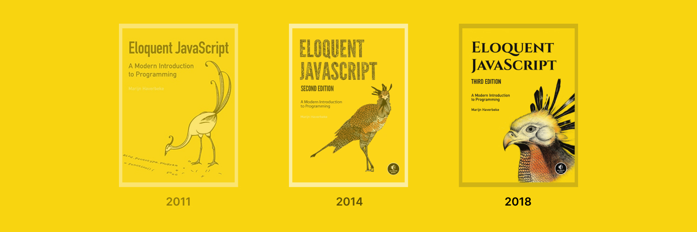

  
  
  
Solved Exercises from the book "Eloquent JavaScript 3rd".

  

    <a href="#about">About</a> · 
    <a href="#core">Core</a> · 
    <a href="#exercises">Exercises</a> · 
    <a href="#contributing">Contributing</a> ·
    <a href="./LICENSE">License</a>
  

## About
This is a repository of exercise solutions for the book **"Eloquent JavaScript 3rd"**. The book is a comprehensive introduction to modern JavaScript, and the solutions here can help those studying to verify if their answers are correct. Feel free to explore and use it as a learning tool.

  

## Core
Here is a table with links to all the topics covered in the book:

| Content (Column 1)                                                                 | Content (Column 2)                                                                    |
| ---------------------------------------------------------------------------------- | ------------------------------------------------------------------------------------- |
| [Introduction](https://eloquentjavascript.net/00_intro.html)                       | [Asynchronous Programming](https://eloquentjavascript.net/11_async.html)              |
| [Values, Types, and Operators](https://eloquentjavascript.net/01_values.html)      | [Project: A Programming Language](https://eloquentjavascript.net/12_language.html)    |
| [Program Structure](https://eloquentjavascript.net/02_program_structure.html)      | [JavaScript and the Browser](https://eloquentjavascript.net/13_browser.html)          |
| [Functions](https://eloquentjavascript.net/03_functions.html)                      | [The Document Object Model](https://eloquentjavascript.net/14_dom.html)               |
| [Data Structures: Objects and Arrays](https://eloquentjavascript.net/04_data.html) | [Handling Events](https://eloquentjavascript.net/15_event.html)                       |
| [Higher-order Functions](https://eloquentjavascript.net/05_higher_order.html)      | [Project: A Platform Game](https://eloquentjavascript.net/16_game.html)               |
| [The Secret Life of Objects](https://eloquentjavascript.net/05_higher_order.html)  | [Drawing on Canvas](https://eloquentjavascript.net/17_canvas.html)                    |
| [Project: A Robot](https://eloquentjavascript.net/07_robot.html)                   | [HTTP and Forms](https://eloquentjavascript.net/18_http.html)                         |
| [Bugs and Errors](https://eloquentjavascript.net/08_error.html)                    | [Project: A Pixel Art Editor](https://eloquentjavascript.net/19_paint.html)           |
| [Regular Expressions](https://eloquentjavascript.net/09_regexp.html)               | [Node.js](https://eloquentjavascript.net/20_node.html)                                |
| [Modules](https://eloquentjavascript.net/10_modules.html)                          | [Project: Skill-Sharing Website](https://eloquentjavascript.net/21_skillsharing.html) |

## Exercises
Here is a table with links to all the exercises covered in the book:

| Exercises (Column 1) | Exercises (Column 2) |
| -------------------- | -------------------- |
|                      |                      |

## Contributing
This is an open project for contributions, and we appreciate all kinds of help, from new solutions to minor error corrections. If you encounter any issues, feel free to [open an issue](https://github.com/wesleydmscn/eloquent-javascript-3rd/issues/new) so we can discuss the best solution. Thank you for contributing to making this project a valuable learning tool for anyone interested in JavaScript.